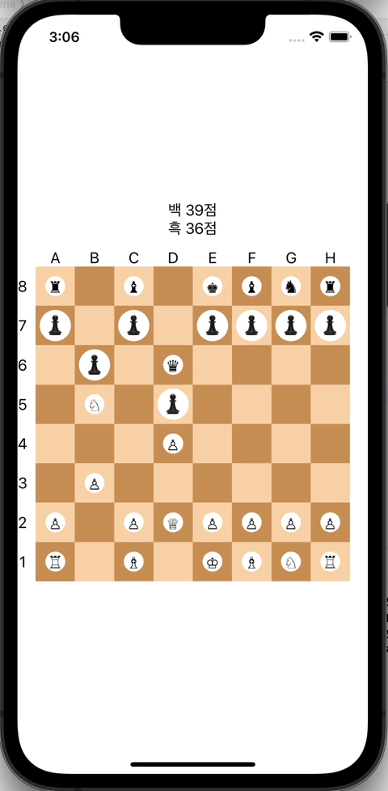

# swift-chess-app
스위프트 체스게임 앱

## 1. 체스보드와 Pawn

### 타입 설명

#### ChessBoard

- 지정한 보드 크기에 맞게 타입 생성
- Position 타입으로 해당 위치가 접근 가능한지, ChessPiece가 있는지 확인
- 기물(ChessPiece)을 이동시키고 이동되었는지 여부를 확인
- `standardChessBoard()` 함수를 통해 표준 체스 보드를 반환

#### ChessPieceProtocol

- 팀 색상 정보(TeamColor), 기물 점수, 기호를 제공
-  해당 Position에서 이동가능한 모든 Position 반환

#### ChessGame

- 매 움직임마다 플레이어 턴을 토글하며 한 플레이어가 두 번 이동하지 못하도록 막음

### 테스트 케이스

- `standardChessBoard()`가 적절한 위치에 폰을 생성했는지?
- `standardChessBoard()`가 폰을 각각 8개씩 생성했는지?
- 매 턴 제대로 된 입력을 넣었을 시 제대로 이동이 가능한지?
- 한 플레이어가 연속 두 번 이동을 시도하거나 아무 기물이 없는 위치에 내린 명령을 차단하는지?
- 폰이 역으로 이동하거나 같은 색 말로 이동할 경우 이동을 차단하는지?

## 2. 체스보드와 체스말

#### 요구사항에 따른 비숍, 룩, 퀸, 나이트 추가

- ChessPiece에 이동할때 밟고 지나가는 포지션을 제공할 수 있도록 함수 추가
- 기물 종류에 따라 다른 기물을 뛰어 넘을수 있거나 없도록 직접 구현 가능

### 테스트 케이스

Game, Board, Piece 별로 테스트 스위트를 나누어 테스트함.
ChessPieceTests에서는 각 기물의 모든 이동가능한 위치를 테스트함.
ChessBoardTests에서는 각 기물을 이동시켰을 때 정상, 비정상 여부를 테스트함.

## 3. 체스보드 화면

BoardView

- ChessBoard를 표현함
- onTapPosition 클로저를 전달해 상위 뷰에서 탭 이후 로직을 작성할 수 있음
- extraFloorContent 뷰빌더를 전달해 특정 위치에 표시할 뷰를 상위 뷰에서 구현할 수 있음

ChessGameView, ChessGameViewModel

- 탭된 위치에 따라 이동 가능 위치를 표시함
- 탭이 이동 명령일 때 기물을 이동시킴